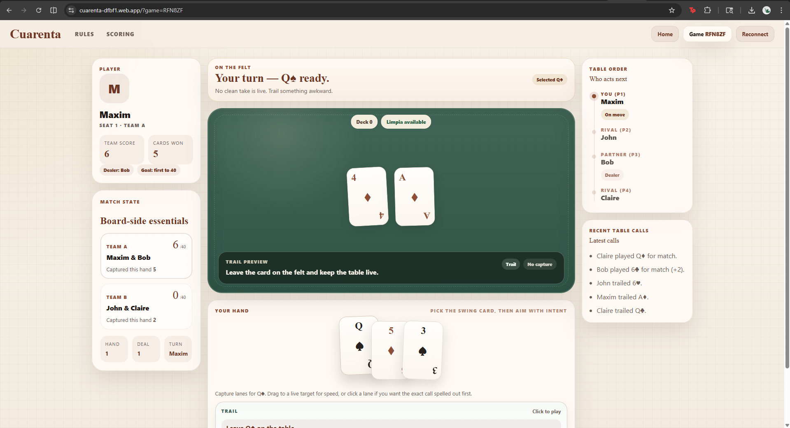

# Cuarenta v0.2.0 release notes

Cuarenta is a pragmatic four-player web implementation of the Ecuadorian card game, built with React, Vite, and Firebase Realtime Database.

Live app: <https://cuarenta-dfbf1.web.app/>

## Highlights

- full four-player match flow to 40 with seating-based teams
- reconnectable game links for same-browser session recovery
- drag-first move selection with clearer capture previews
- in-app rules and scoring reference for edge cases
- emulator-first local setup for contributors
- Firebase anonymous auth for lightweight player identity
- tighter Realtime Database rules than the earlier open-write prototype

## Release focus

This release marks the first public-ready version of the current rewrite:

- the game is real and playable
- setup is explicit instead of silently pointing at a live backend
- the trust model is clearer and safer than the original prototype
- the rough edges are called out directly instead of hidden behind launch copy

## Known rough edges

- gameplay is still client-authoritative
- anonymous auth improves the public-demo story, but it is not a full anti-abuse system
- reconnect is same-browser, not general cross-device handoff
- the remembered ronda-caída +10 bonus is still not implemented

## Short release blurb

A small but real Cuarenta web app: four-player lobby, reconnectable links, better move previews, and a lightweight anonymous-auth path instead of a wide-open write surface. Playable today, still intentionally rough around public-service hardening.
